# Guided Emotional Journey — Software Requirements Specification (SRS)
**Version:** 2.0 (Hackathon MVP + Full Vision)  
**Platform:** iOS (SwiftUI) + optional watchOS companion  
**Playback:** Spotify iOS SDK (App Remote)  
**LLM:** Anthropic Claude API  
**Backend:** Lightweight proxy (Vercel / Cloudflare Worker / Render)  
**Timeframe:** 40 hours hackathon (MVP) · Full vision pitched  
**Owner:** Team Ayush

---

## Table of Contents
1. [Purpose](#1-purpose)
2. [Scope](#2-scope)
3. [Definitions](#3-definitions)
4. [Users & Use Cases](#4-users--primary-use-cases)
5. [Functional Requirements](#5-functional-requirements)
6. [Non-Functional Requirements](#6-non-functional-requirements)
7. [System Architecture](#7-system-architecture)
8. [Backend Specification](#8-backend-specification)
9. [LLM Integration Specification](#9-llm-integration-specification)
10. [Journey Engine Specification](#10-journey-engine-specification)
11. [Apple Watch Integration (v1.5)](#11-apple-watch-integration-v15)
12. [Data Storage](#12-data-storage)
13. [Testing & Acceptance Plan](#13-testing--acceptance-plan)
14. [Implementation Plan (40 hours)](#14-implementation-plan-40-hours)
15. [Full Vision Roadmap (Pitch)](#15-full-vision-roadmap-pitch)
16. [Project Flowcharts & Diagrams](#16-project-flowcharts--diagrams)
17. [Open Decisions](#17-open-decisions)

---

## 1. Purpose
Build an iOS wellness app that helps users regulate emotions through a **guided, time‑boxed music journey** rather than a generic playlist. The user selects their **current emotion**, **desired goal state**, and **duration**. The app generates a **multi‑stage regulation trajectory** (Validate → Shift → Stabilize → Target) and plays a sequence of tracks from the user's **personal Spotify favorites**. A lightweight backend proxies LLM calls securely. An optional Apple Watch integration adds **physiological closed-loop feedback** for sleep and focus modes.

---

## 2. Scope

### 2.1 In-scope (Hackathon MVP — 40 hours)
- iOS app (SwiftUI)
- Spotify iOS SDK (App Remote) for playback control
- User-built personal library ("My Seeds") via Spotify search
- Fast track tagging (user taps) + Claude-assisted enrichment
- Lightweight backend proxy for Claude API key security
- Journey planning + queue generation (deterministic engine)
- Claude-generated coaching lines + session insights
- In-session 1-tap check-ins + deterministic adaptation
- Session summary + simple patterns dashboard
- Sleep Journey shortcut (manual "home" prompt)
- Basic HealthKit HR read during Sleep Journey (if time permits)

### 2.2 In-scope (Full Vision — pitched but not fully built)
- Apple Watch companion app with real-time HR/HRV streaming
- Closed-loop Focus DJ mode (Watch-driven adaptation)
- Full sleep tracking integration (auto-detect sleep, fade out)
- Backend with user accounts + session history sync
- Preference learning model (which journeys work for this user)
- Expanded catalog integration (beyond personal seeds)

### 2.3 Out-of-scope
- Clinical claims, diagnosis, or treatment language
- Full Spotify catalog AI selection (post-hackathon)
- Android / web versions
- Social features

---

## 3. Definitions
| Term | Definition |
|---|---|
| **Seed library / My Seeds** | User-selected favorite Spotify tracks stored locally |
| **Journey** | Structured sequence of segments to move user from current to target state |
| **Segment** | One stage: Validate, Shift, Stabilize, or Target |
| **Track tags** | Numeric features (energy, valence, lyrics) and roles |
| **Roles** | Functional labels: validate_high, validate_low, downshift, stabilize_focus, uplift, sleep_winddown |
| **Closed-loop** | System reads physiological signals and adjusts music automatically |
| **Open-loop** | System relies on user self-report only (no Watch) |

---

## 4. Users & Primary Use Cases

### 4.1 Personas
| Persona | Scenario | Mode |
|---|---|---|
| Anxious student | Before exam → needs calm/focus | Emotion Journey |
| Stressed worker | End of day → needs wind-down | Emotion Journey |
| Sleeper | In bed, can't settle → needs sleep | Sleep Journey (Watch-enhanced) |
| Low energy | Numb/sad morning → needs energy | Emotion Journey |
| Deep worker | 45-min focus block → needs sustained attention | Focus DJ (Watch-enhanced, v1.5) |

### 4.2 Core Use Cases
1. Onboard + connect Spotify
2. Build library ("My Seeds")
3. Tag seeds (taps) + enrich (Claude via backend)
4. Start a session (emotion, goal, duration, intensity)
5. Play guided journey + check-ins
6. Review session summary + insights
7. View patterns
8. Sleep Journey (with optional Watch HR)
9. Focus DJ (full vision, Watch-driven)

---

## 5. Functional Requirements

### 5.1 Spotify Authentication & Playback
**FR-1:** App shall authenticate with Spotify via iOS SDK (App Remote).  
**FR-2:** App shall allow searching Spotify and adding tracks to "My Seeds."  
**FR-3:** App shall store per track: spotifyURI, title, artist, artworkURL.

---

### 5.2 Track Tagging (User Taps + Claude Enrichment)

#### 5.2.1 User taps (fast labeling)
**FR-4:** Per seed track, collect 3 tap inputs:
- Energy: Low / Medium / High
- Lyrics: None / Some / Heavy
- Feel: Comforting / Neutral / Uplifting

#### 5.2.2 Claude enrichment (via backend)
**FR-5:** App calls backend /api/tag-tracks which proxies to Claude. Returns:
- energy (0..1), valence (0..1), lyrics (0..1)
- roles array from fixed set
- notes (optional, <= 12 words)

**FR-6:** App persists enriched tags locally.

#### 5.2.3 Fallback (Claude unavailable)
**FR-7:** Deterministic fallback mapping:
- Energy Low/Med/High → 0.2/0.5/0.8
- Lyrics None/Some/Heavy → 0.1/0.5/0.9
- Feel Comforting/Neutral/Uplifting → Valence 0.45/0.55/0.75
- Roles assigned using rules (Section 10.3)

---

### 5.3 Session Setup
**FR-8:** User starts session with:
- Emotion: anxious / angry / sad / numb
- Goal: calm / focus / energize / sleep
- Duration: 10 / 15 minutes
- Intensity: slider 0..1 (default 0.5)

**FR-9:** App shows Journey Plan preview (4 segments + intent).

---

### 5.4 Journey Planning (Deterministic Core)
**FR-10:** Segment durations: Validate ~20%, Shift ~35%, Stabilize ~25%, Target ~20%.  
**FR-11:** Each segment has a FeatureTarget (energy, valence, lyrics, maxDeltaEnergy).  
**FR-12:** Queue generated from tagged seeds by scoring.  
**FR-13:** Smooth transitions enforced; sleep mode enforces low lyrics after 20%.

---

### 5.5 Playback UI
**FR-14:** Play current queue item via Spotify URI.  
**FR-15:** Display: segment name, track info, coaching line.  
**FR-16:** 1-tap check-ins: Helped / Same / Worse.

---

### 5.6 Closed-loop Adaptation (Check-ins)
**FR-17:** Log check-ins with timestamp + track.  
**FR-18:** Adaptation:
- Helped → continue
- Same → shift strength +10%
- Worse → Safe Mode (low lyrics, tight energy steps, neutral valence)

---

### 5.7 Session Summary + Patterns
**FR-19:** Summary: inputs, tracks, check-ins, 1–2 Claude insights.  
**FR-20:** Patterns tab: history, top helpful tracks, best goals.

---

### 5.8 Sleep Journey Shortcut
**FR-21:** "Are you at home and ready to sleep?" → comfort phase → wind-down.

---

### 5.9 Apple Watch Integration (Sleep/Focus)
**FR-22:** If HealthKit permission granted, read HR during Sleep Journey.  
**FR-23:** Adaptation based on HR:
- HR dropping → continue plan
- HR flat/rising + low motion → soften further
- Sleep detected → fade out + stop

**FR-24 (Full Vision):** Focus DJ mode reads HRV + HR continuously and adjusts in real-time.

---

## 6. Non-Functional Requirements

### 6.1 Reliability
- App works without Claude (fallback tags + deterministic planning)
- App works without Watch (check-in-only adaptation)
- Spotify failure → retry UI

### 6.2 Performance
- Backend Claude call < 10s for 40 tracks
- Local queue generation < 1s
- HealthKit polling: every 60 seconds (sufficient for music adaptation)

### 6.3 Privacy
- Disclose what is sent to Claude
- Optional "privacy mode": send only taps, not track names
- Data stored locally in MVP
- HealthKit data never leaves device (processed on-device only)

### 6.4 Safety
- No medical claims
- 3× "Worse" → suggest stopping + neutral grounding + optional support resources

---

## 7. System Architecture

### 7.1 High-Level Architecture Diagram

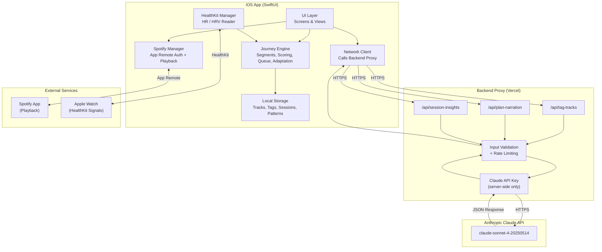

### 7.2 iOS App Modules
| Module | Responsibility |
|---|---|
| **SpotifyManager** | Auth, search, playback control via App Remote |
| **HealthKitManager** | Request permissions, poll HR/HRV, detect sleep |
| **LibraryStore** | CRUD for seed tracks + tags (local) |
| **ClaudeClient** | Network calls to backend proxy |
| **JourneyEngine** | Segment generation, scoring, queue building, adaptation |
| **SessionRecorder** | Log check-ins, compute summaries, store history |
| **PatternsAnalyzer** | Aggregate sessions for insights dashboard |

---

## 8. Backend Specification

### 8.1 Purpose
The backend exists to:
1. **Protect the Claude API key** (never stored on device)
2. **Validate inputs** before sending to Claude
3. **Rate-limit** requests (prevent abuse / runaway costs)
4. **Standardize responses** (parse Claude output, enforce JSON schema)

### 8.2 Technology Choice (Hackathon)
**Recommended:** Vercel Edge Functions (free tier, fast deploy)  
**Alternatives:** Cloudflare Workers, Render, or a simple Express server on Railway

### 8.3 Backend Data Flow

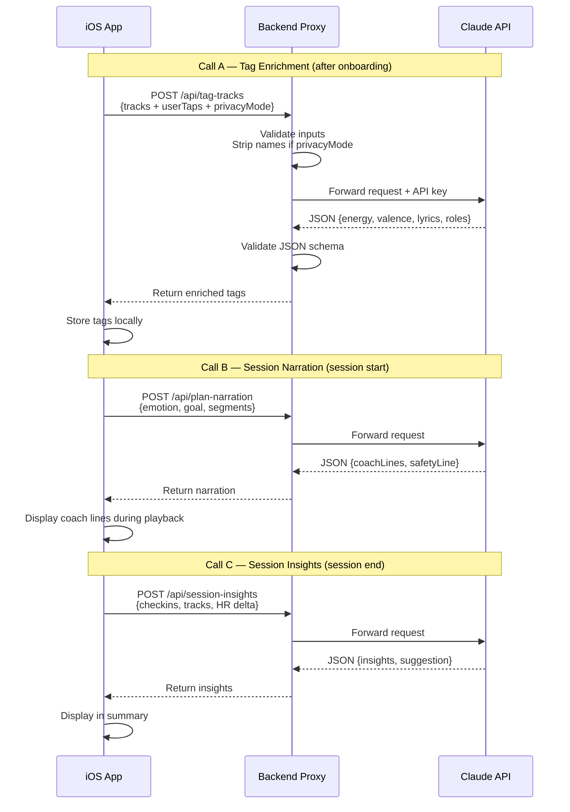

### 8.4 Endpoints

#### POST /api/tag-tracks
**Purpose:** Batch tag enrichment  
**Called when:** User finishes tagging seeds and taps "Generate Smart Tags"  
**Input:** List of tracks with spotifyURI, title, artist, and userTaps (energy/lyrics/feel classes). Includes a privacyMode flag — if true, backend strips title and artist before sending to Claude.  
**Output:** For each track: energy (0..1), valence (0..1), lyrics (0..1), roles array, optional notes.  
**Error:** Returns a fallback flag so the iOS app uses deterministic logic.

#### POST /api/plan-narration
**Purpose:** Generate coaching lines for a session  
**Called when:** Session starts, journey plan is computed  
**Input:** Emotion, goal, intensity, duration, and the segment plan (names + durations).  
**Output:** For each segment: a coachLine (short supportive text), an intent (therapeutic purpose), and a safetyLine.

#### POST /api/session-insights
**Purpose:** Generate post-session insights  
**Called when:** Session ends  
**Input:** Session summary including emotion, goal, duration, check-in sequence, tracks played (with tags and segments), and optional Watch data (start/end HR).  
**Output:** 1–2 insight strings and a nextTimeSuggestion string.

### 8.5 Backend Responsibilities Summary
| Responsibility | Implementation |
|---|---|
| API key protection | Key in environment variable, never sent to client |
| Input validation | Check required fields, cap array sizes (max 50 tracks) |
| Rate limiting | Max 10 requests/min per user (IP-based for MVP) |
| Schema enforcement | Parse Claude response, validate JSON shape, return error if malformed |
| Privacy mode | Strip track names before forwarding to Claude |
| Fallback signal | Return fallback: true so iOS app uses deterministic logic |

---

## 9. LLM Integration Specification

### 9.1 Where the LLM IS required (and why)
| LLM Call | Purpose | Why LLM (not deterministic) | Failure mode |
|---|---|---|---|
| **A: Tag enrichment** | Convert coarse taps → numeric tags + roles | LLM knows music context ("Marconi Union = ambient, calming") | Fallback mapping |
| **B: Session narration** | Generate coaching lines per segment | Natural, empathetic language that feels guided | Templated copy |
| **C: Session insights** | Post-session actionable takeaways | Correlate patterns across sessions in natural language | Deterministic stats |

### 9.2 Where the LLM is NOT used
| Function | Why deterministic is better |
|---|---|
| **Track selection / queue building** | Must be predictable, fast, constraint-respecting |
| **Closed-loop adaptation** | Latency-sensitive; rules are simpler and safer |
| **HR/HRV interpretation** | Medical-adjacent; use fixed thresholds, not LLM inference |
| **Sleep detection** | Use HealthKit sleep stage data directly |

### 9.3 LLM Responsibility Boundary

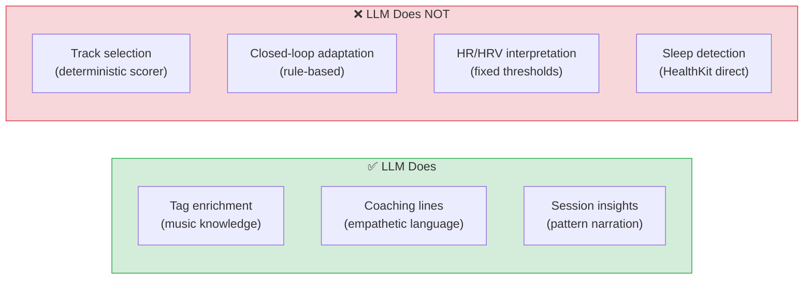

### 9.4 Claude Prompt Design

#### Prompt A: Tag Enrichment
- System role: Music tagging assistant for a wellness app
- Rules enforced: energy/valence/lyrics must be 0.0–1.0; roles from fixed set only; notes ≤ 12 words; JSON only output; if unsure, use user taps as primary signal
- User message: list of tracks with title, artist, and user tap classes
- Expected output: array of tracks with numeric tags, roles, and notes

#### Prompt B: Session Narration
- System role: Supportive wellness coach
- Rules enforced: coachLine max 15 words, present tense, second person; intent max 20 words; always include safetyLine; never make medical claims; JSON only
- Input: emotion, goal, segment plan
- Output: coaching lines + safety line per segment

#### Prompt C: Session Insights
- System role: Session analyst
- Rules enforced: reference specific data (HR change, check-in pattern); 1–2 sentences per insight; encouraging but honest; never diagnose; JSON only
- Input: session summary with check-ins, tracks, optional HR delta
- Output: 1–2 insights + next-time suggestion

### 9.5 LLM Call Cost Estimate (Hackathon)
| Call | Frequency | Est. cost per call |
|---|---|---|
| Tag enrichment | 1–3 times total (per library build) | ~$0.02 |
| Session narration | Once per session | ~$0.005 |
| Session insights | Once per session | ~$0.007 |

**Total hackathon cost estimate: < $1.00**

---

## 10. Journey Engine Specification

### 10.1 Journey Segment Flow

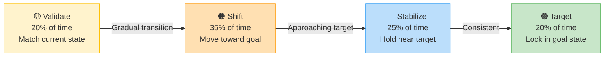

### 10.2 Segment Template
For session duration T:
| Segment | % of T | Purpose |
|---|---|---|
| Validate | 20% | Match current emotional state (don't fight it) |
| Shift | 35% | Gradually move features toward goal |
| Stabilize | 25% | Hold at near-target level, prevent rebound |
| Target | 20% | Lock in at goal state |

### 10.3 Target Features by Emotion→Goal

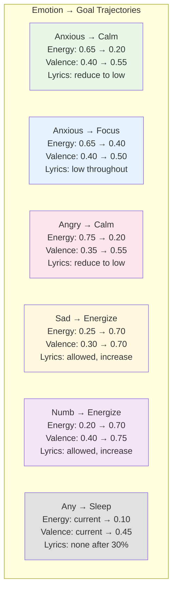

Intermediate segments interpolate linearly between validate and target values.

### 10.4 Track Selection Scoring
For each candidate track against a segment target:
- Compute weighted distance across energy, valence, and lyrics (weights: 0.4, 0.3, 0.3)
- Add a smoothness penalty if energy jump from previous track exceeds maxDeltaEnergy
- Add a role penalty if the track doesn't have the required role for the segment
- Pick the track with the lowest total score; break ties by preferring unplayed tracks

### 10.5 Fallback Role Assignment (No Claude)
| Condition | Assigned roles |
|---|---|
| energy >= 0.7 | validate_high, uplift |
| energy <= 0.35 | validate_low, downshift |
| energy <= 0.35 AND lyrics <= 0.2 | + sleep_winddown |
| energy 0.35–0.6 AND lyrics <= 0.35 | stabilize_focus |

### 10.6 Check-in Adaptation Rules
| Check-in | Action |
|---|---|
| Helped | Continue planned trajectory |
| Same | Move next segment target 10% closer to final goal |
| Worse | Safe Mode for next 1–2 tracks: lyrics ≤ 0.35, maxDeltaEnergy = 0.15, valence 0.45–0.65 |
| 3× Worse | Suggest stopping; switch to neutral grounding track; show support message |

---

## 11. Apple Watch Integration (v1.5)

### 11.1 Available HealthKit Signals
| Signal | Sampling | Use |
|---|---|---|
| Heart Rate | ~every 5–15s when Watch worn | Arousal proxy |
| HRV (SDNN) | Periodic | Stress/relaxation |
| Resting HR | Daily | Personal baseline |
| Sleep Stages | During sleep | Detect asleep state |
| Respiratory Rate | During sleep | Calm breathing proxy |

### 11.2 Hackathon MVP: Sleep Journey HR Loop

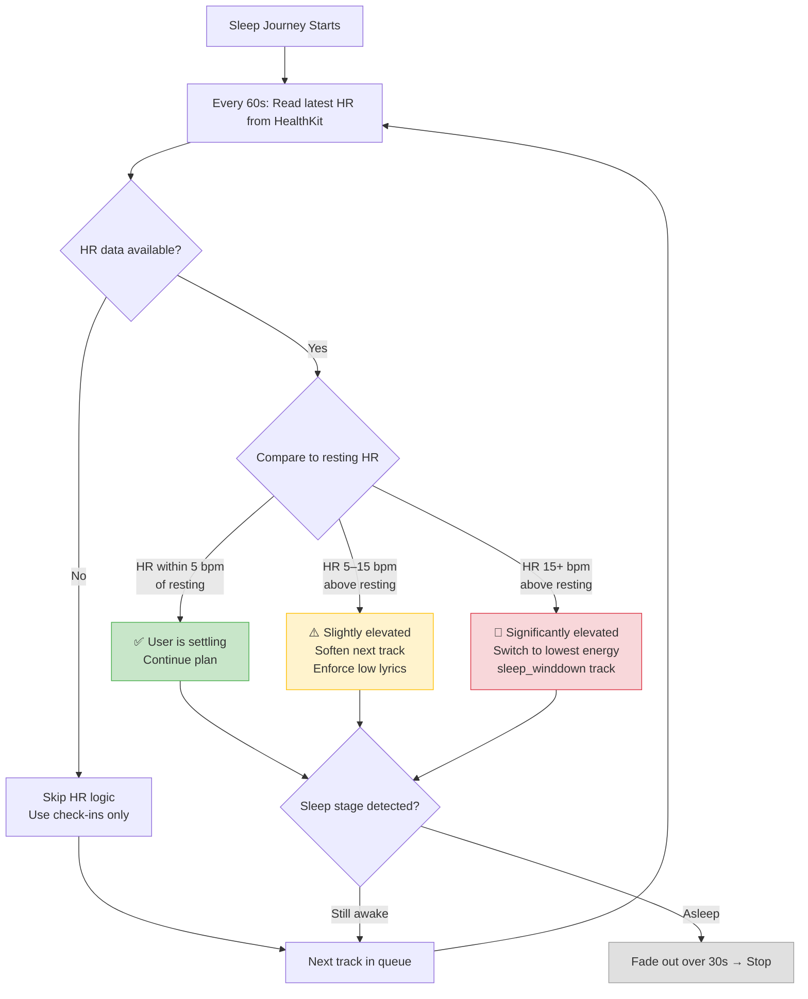

### 11.3 Full Vision: Focus DJ Mode (Pitched)

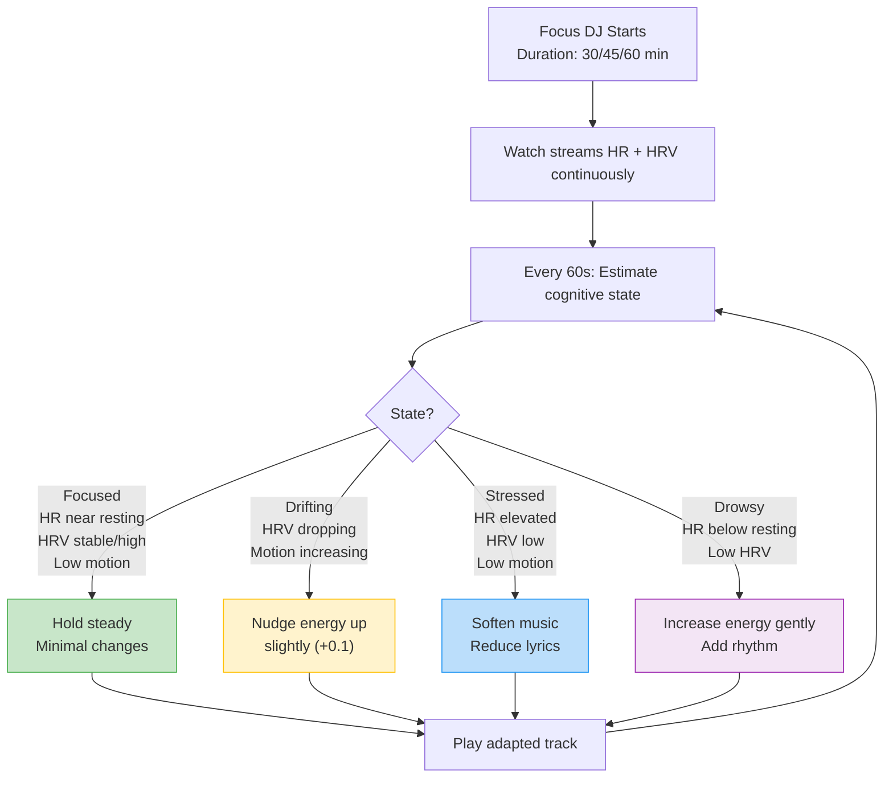

### 11.4 What the LLM does with Watch data
| Scenario | LLM role | When |
|---|---|---|
| Sleep journey with HR | Does NOT interpret HR in real-time (deterministic rules do that) | — |
| Post-session summary | References HR delta: "Your HR dropped 16 bpm during the session" | After session |
| Focus DJ insights | Correlates HRV patterns with track choices | After session |
| Coaching adjustments | "Your Watch suggests you're still activated — extending the shift phase" | Full vision only |

**Critical rule:** LLM never makes real-time physiological decisions. It narrates and explains *after* deterministic rules act.

---

## 12. Data Storage

### 12.1 Local Storage (MVP)
Technology: SwiftData or JSON files with Codable

**Entities stored locally:**

**Track** — spotifyURI, title, artist, artworkURL, user taps (energy class, lyrics class, feel class), enriched tags (energy 0..1, valence 0..1, lyrics 0..1, roles array, notes)

**Session** — id, timestamp, emotion, goal, intensity, duration, segment plan (name, seconds, target, coach line per segment), queue (segment name, track id, reason per item), check-ins (timestamp, track id, helped/same/worse), optional watch data (start HR, end HR, HR samples), optional insights (insight strings, next-time suggestion)

### 12.2 Entity Relationship

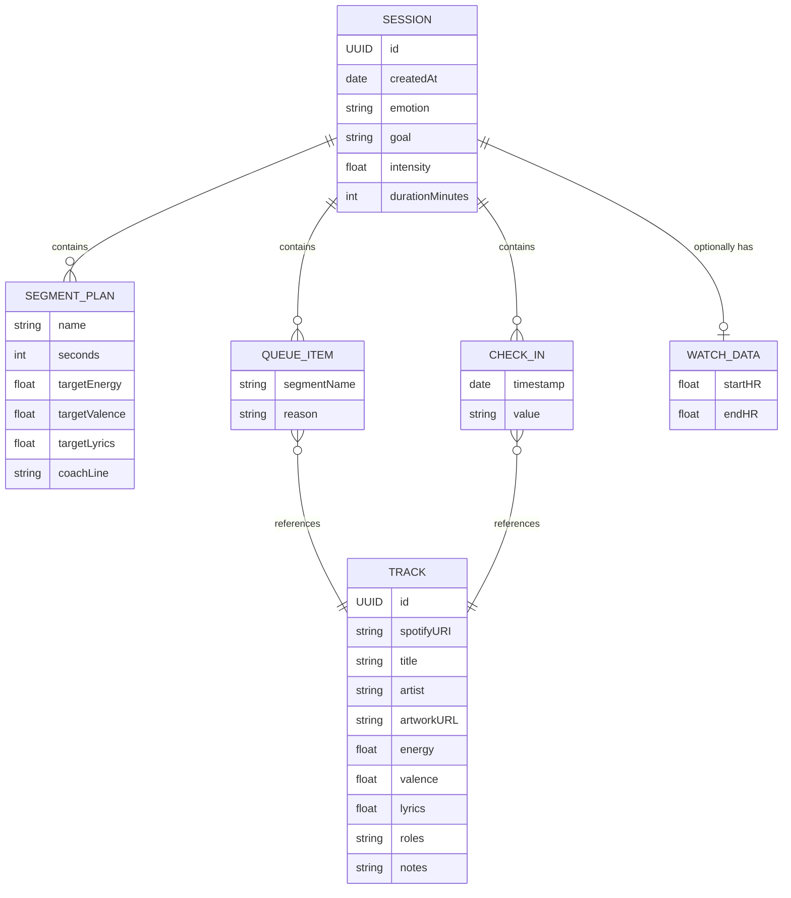

### 12.3 Backend Storage
- **Hackathon MVP:** None. Backend is stateless proxy.
- **Full vision:** User accounts + session sync (Supabase / Firebase).

---

## 13. Testing & Acceptance Plan

### 13.1 Functional Tests
| # | Test | Pass criteria |
|---|---|---|
| 1 | Connect Spotify | Auth succeeds, can play a URI |
| 2 | Add 12+ tracks | Tracks saved locally with URIs |
| 3 | Tag + enrich | Claude returns valid tags; stored locally |
| 4 | Fallback tags | Disable Claude; tags still generated deterministically |
| 5 | Anxious→Calm session | Queue: energy decreases across segments |
| 6 | Check-in "Worse" | Next track has lower energy + lyrics than planned |
| 7 | 3× Worse | App suggests stopping |
| 8 | Sleep journey | Last 70% of tracks have lyrics ≤ 0.35 |
| 9 | Session summary | Shows check-in counts + Claude insights |
| 10 | Patterns | Shows session history + top tracks |

### 13.2 Failure Mode Tests
| Failure | Expected behavior |
|---|---|
| Claude returns invalid JSON | Backend returns fallback flag; app uses deterministic |
| Claude timeout (>10s) | Backend returns timeout; app uses fallback |
| Spotify disconnects | Show reconnect UI; queue position preserved |
| Library too small (<6 tracks) | Warn user; allow tracks to repeat with notice |
| No Watch data available | Silently skip HR logic; use check-ins only |

---

## 14. Implementation Plan (40 hours)

### 14.1 Timeline

```mermaid
gantt
    title 40-Hour Hackathon Implementation Plan
    dateFormat HH
    axisFormat %H

    section Foundation
    Project setup + scaffold          :f1, 00, 2h
    Spotify auth + App Remote         :f2, after f1, 4h

    section Library + Tagging
    Search UI + My Seeds CRUD         :l1, after f2, 2h
    Tagging taps UI                   :l2, after l1, 2h
    Backend /api/tag-tracks           :l3, after l2, 2h
    Claude client + fallback          :l4, after l3, 2h

    section Journey Engine
    Segment generation + targets      :j1, after l4, 3h
    Track scoring + queue builder     :j2, after j1, 3h

    section Player
    Journey plan preview UI           :p1, after j2, 2h
    Player screen + playback          :p2, after p1, 2h
    Check-in buttons + adaptation     :p3, after p2, 2h

    section Narration
    Backend /api/plan-narration       :n1, after p3, 2h
    Coach lines in player UI          :n2, after n1, 2h

    section Summary
    Session summary screen            :s1, after n2, 2h
    Backend /api/session-insights     :s2, after s1, 2h

    section Sleep + Watch
    Sleep journey screen + arc        :w1, after s2, 2h
    HealthKit HR polling              :w2, after w1, 2h

    section Polish
    Patterns dashboard                :x1, after w2, 2h
    Edge cases + demo mode            :x2, after x1, 2h
    Demo prep + rehearsal             :x3, after x2, 2h
```

### 14.2 Hour-by-hour breakdown

**Hours 0–2: Project setup**
- Xcode project, SwiftUI scaffold
- Spotify iOS SDK integration
- Backend project initialized

**Hours 2–6: Spotify auth + library**
- SpotifyManager: auth flow + App Remote connect
- Search UI: search Spotify, display results
- "My Seeds" list: add/remove tracks
- Local persistence

**Hours 6–10: Tagging UI + Claude integration**
- Tagging screen: 3 taps per track
- Backend /api/tag-tracks endpoint
- ClaudeClient on iOS: call backend, parse response
- Fallback mapping if Claude fails
- Persist enriched tags

**Hours 10–16: Journey Engine (core algorithm)**
- Segment generation (durations + targets)
- Track scoring function
- Queue builder with smoothness constraints

**Hours 16–22: Journey Plan UI + Player**
- Plan preview screen (segment list + mini curve visual)
- Player screen: track info + segment name + coach line
- Spotify playback: play URI, detect track end, advance queue
- 1-tap check-in buttons

**Hours 22–26: Narration + Adaptation**
- Backend /api/plan-narration endpoint
- Coach lines displayed per segment
- Check-in adaptation logic (Same/Worse/Helped)
- Safe Mode implementation

**Hours 26–30: Session Summary + Insights**
- Summary screen: inputs, tracks, check-ins
- Backend /api/session-insights endpoint
- Display insights
- Session history stored locally

**Hours 30–34: Sleep Journey + HealthKit**
- Sleep Journey shortcut screen
- "Are you home?" prompt
- Sleep arc: comfort → wind-down
- HealthKit: request HR permission
- Poll HR during sleep journey (best effort)
- HR-based adaptation (if data available)

**Hours 34–38: Patterns + Polish**
- Patterns tab: session list, top tracks, best goals
- Edge cases: empty library, no Spotify, no Claude
- Loading states, error states
- Demo mode: pre-loaded library for stage demo

**Hours 38–40: Demo prep**
- Demo script rehearsal
- Pre-load test library + run 1–2 test sessions
- Screen recording backup (in case live demo fails)

### 14.3 Team allocation (if 3 people)
| Person | Focus |
|---|---|
| **Dev A (iOS Lead)** | Spotify SDK, playback, UI screens |
| **Dev B (Engine + Data)** | Journey engine, scoring, local storage, HealthKit |
| **Dev C (Backend + LLM)** | Vercel proxy, Claude prompts, testing, demo prep |

---

## 15. Full Vision Roadmap (Pitch)

### 15.1 What judges see in the demo (40h MVP)
1. User picks anxious → calm, 15 min
2. Journey plan with coaching lines appears
3. Music plays through Spotify; segments transition smoothly
4. User taps "same" → next track adapts
5. User taps "worse" → visible safer switch
6. Session ends → insights displayed
7. Sleep journey: "Are you home?" → comfort → wind-down

### 15.2 Product Roadmap

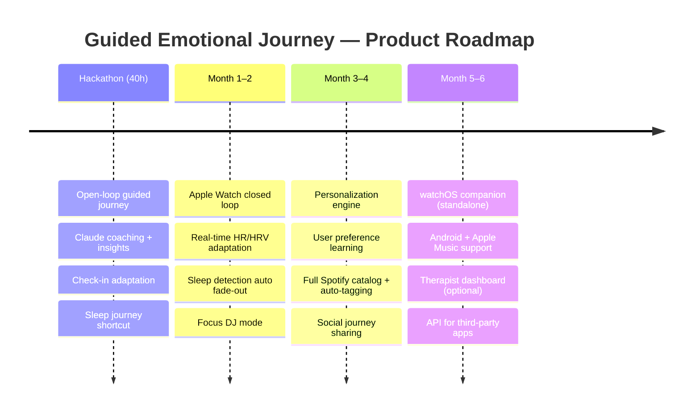

### 15.3 Key pitch lines
- "Guided protocol, not a playlist — 4-stage emotional trajectory"
- "Closed-loop: your body's signals adjust the music in real-time"
- "LLM coaches you through the journey and learns what works"
- "Privacy-first: health data never leaves your device"

---

## 16. Project Flowcharts & Diagrams

### 16.1 Complete User Flow

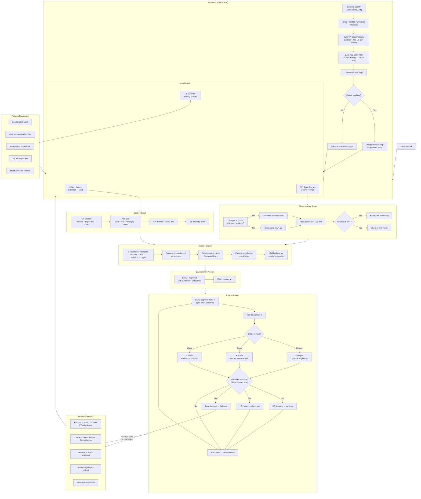

### 16.2 Track Selection Decision Tree

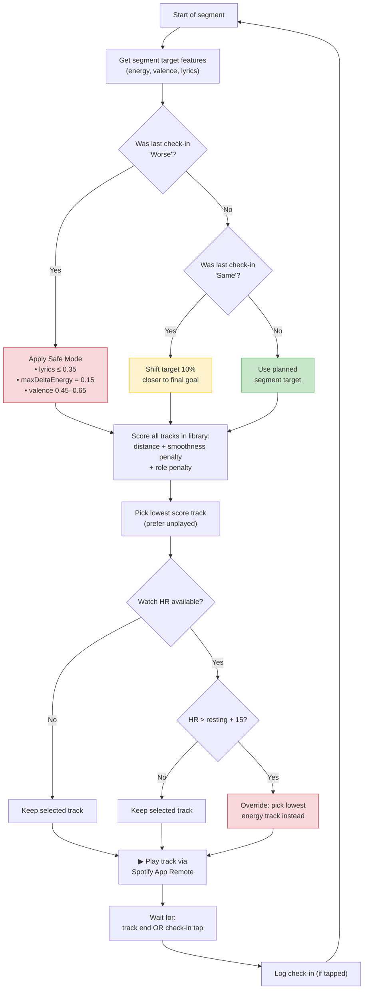

### 16.3 Safety Escalation Flow

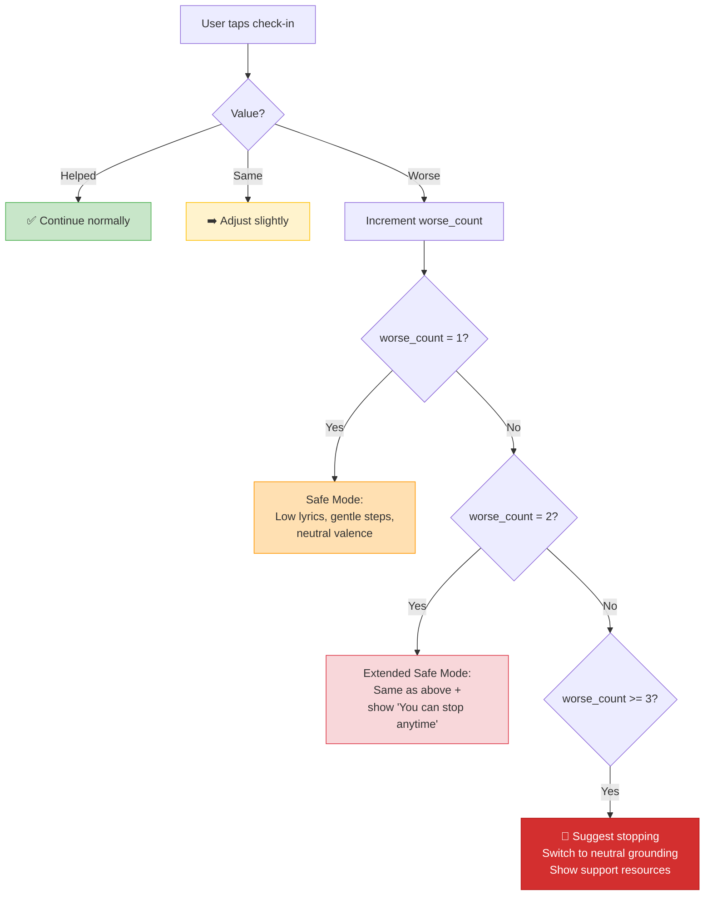

### 16.4 Data Privacy Flow

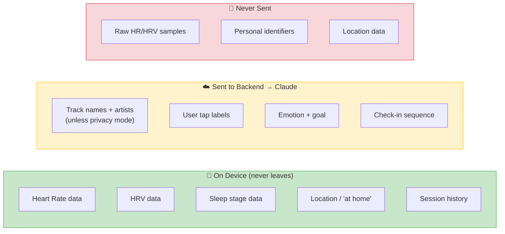

---

## 17. Open Decisions (Lock Before Hour 0)
| # | Decision | Recommendation | Impact if wrong |
|---|---|---|---|
| 1 | Min seed tracks | 12–15 | Too few → queue repeats; too many → tagging takes too long |
| 2 | Backend platform | Vercel (free, fast deploy) | Blocked on deploy → call Claude directly, rotate key after |
| 3 | Privacy mode | Include toggle (send taps only) | Judges may ask about privacy; toggle shows you thought about it |
| 4 | Duration options | 10 and 15 min only | More options → more edge cases in 40h |
| 5 | Claude model | claude-sonnet-4-20250514 (balance of speed + quality) | Haiku if latency matters more; Opus if quality matters more |
| 6 | Local storage | JSON + Codable (simpler for hackathon) | SwiftData is cleaner long-term but has learning curve |
| 7 | Demo mode | Yes — pre-loaded library | Live demo with real Spotify auth can fail on stage |

---

## Appendix A: Demo Script (2 minutes)

### Setup (before going on stage)
- App pre-loaded with 15 tagged tracks
- Spotify logged in
- One completed session in history

### Script
1. **[0:00–0:15]** "Most music apps give you a playlist. We give you a guided emotional journey."
2. **[0:15–0:30]** Show: tap Anxious → Calm → 15 min. Journey plan appears with 4 stages + coaching lines.
3. **[0:30–0:50]** Start playback. Show validate phase playing. Point out coaching line.
4. **[0:50–1:10]** Tap "Same" → show next track adapts (shift strengthens). Tap "Worse" → show safe mode activates (visible change in track choice).
5. **[1:10–1:30]** Skip to session summary. Show insights: "Low-lyric tracks worked best. Your HR dropped 16 bpm."
6. **[1:30–1:45]** Show patterns tab: "3 sessions this week, calm journeys work best for you."
7. **[1:45–2:00]** "And when you wear your Apple Watch to bed, the app detects if you're not settling and automatically adjusts. This is emotion regulation, not recommendation."

---

## Appendix B: Module Structure

**App/** — App entry point

**Models/** — Track, Session, SegmentPlan, CheckIn, Enums (Emotion, Goal, TrackRole, etc.)

**Engine/** — JourneyEngine (segment generation + scoring), TrackScorer (distance + penalties), AdaptationRules (check-in + HR adaptation), FallbackTagger (deterministic tag mapping)

**Services/** — SpotifyManager (App Remote auth + playback), HealthKitManager (HR reading + permissions), ClaudeClient (network calls to backend), StorageManager (local persistence)

**Views/** — Onboarding (SpotifyConnect, SeedSearch, Tagging), Session (SessionSetup, JourneyPlan, Player, SleepJourney), Summary (SessionSummary, Patterns), Components (SegmentCurve, CheckInButtons, CoachLine)

**Backend/** — api/ (tag-tracks, plan-narration, session-insights), lib/ (Claude wrapper, validation)
